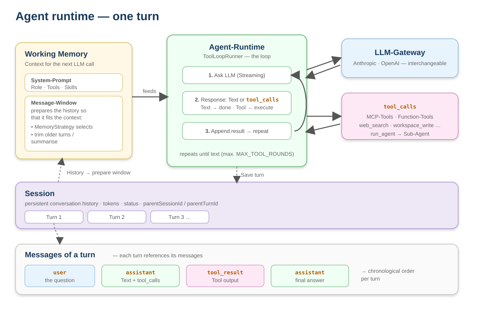
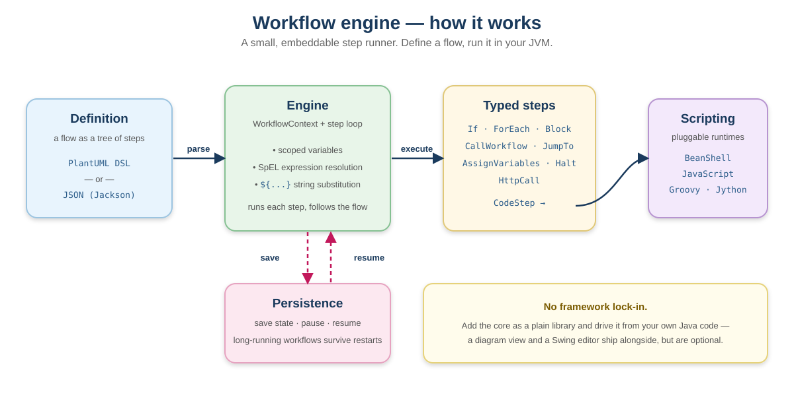

<p align="center">
  <picture>
    <source media="(prefers-color-scheme: dark)" srcset=".github/assets/logo-dark.svg">
    
  </picture>
</p>

<h1 align="center">MindConnect</h1>

[](https://github.com/mindconnect-ai/mindconnect/actions/workflows/build.yml)
[](LICENSE)
[](https://adoptium.net/)
[](CONTRIBUTING.md)

A multi-module Maven monorepo for building LLM-powered agents and the
server-driven UIs to operate them. Four areas — **each is fully
self-contained and usable on its own**:

| Area | What it is | README |
|------|------------|--------|
| **[agents/](agents/)** | Agentic runtime — sessions, memory, tools, sub-agents, LLM gateway, and the deployable agent server + CLI | [agents/README.md](agents/README.md) |
| **[workflow/](workflow/)** | A **small, fast workflow engine that embeds into any Java application**, with multi-language scripting (BeanShell, JS, Groovy, Jython), persistence and a diagram UI | [workflow/README.md](workflow/README.md) |
| **[taskqueue/](taskqueue/)** | A **dependency-free task queue** — virtual-thread workers, suspend/resume, retries, cron scheduling, optional Postgres backend and clustering; the sub-agent engine runs on it | [taskqueue/README.md](taskqueue/README.md) |
| **[common/](common/)** | Shared utilities — domain primitives, file manager, web scraper, path accessor, mini script runner | [common/README.md](common/README.md) |

The server-driven UI framework lives in its own repo now:
**[mc-semantic-ui](https://github.com/mindconnect-ai/mc-semantic-ui)** — one
typed JSON model that renders as SSR HTML, a live SPA, or in a visual editor.
The admin UIs here consume its published artifacts.

Nothing forces you to adopt the whole stack: embed the **workflow** engine as
a library, or run the **agents** platform standalone.

The agentic runtime is the centerpiece: a meta-assistant that orchestrates
specialized sub-agents. It can drive the workflow engine as a tool and use
semantic-ui for agent-facing and administrative interfaces.

### Agentic runtime



### Workflow engine

A small, embeddable step runner: define a flow, run it in your JVM.



## Requirements

- Java 21
- Maven 3.9+

## Build

```bash
# Build everything
mvn clean install -DskipTests

# Or build a single area
mvn -f agents/pom.xml   clean install -DskipTests
mvn -f workflow/pom.xml clean install -DskipTests
```

See each area's README for how to run its servers, demos and tests.

## License

Licensed under the **[Apache License 2.0](LICENSE)** — free to use, modify
and distribute, including commercially. Please keep the [`NOTICE`](NOTICE)
file intact; if you build on it, a link back to this repository is
appreciated.

## Adopters & consulting

Using MindConnect? Add yourself to **[ADOPTERS.md](ADOPTERS.md)** via a pull
request — optional, but it helps the project and gives you a public
reference. For integration help, custom development or support, the
maintainer offers consulting; reach out via
[Discussions](https://github.com/mindconnect-ai/mindconnect/discussions).

## Support the project

MindConnect is free and Apache-2.0 licensed, built and maintained in the
open. If it's useful to you, you can support continued development:

- ☕ **[Ko-fi](https://ko-fi.com/beisdog)** — buy me a coffee

Sponsoring is entirely optional and grants no extra rights over the
Apache-2.0 license — it just keeps the work going. 🙏
