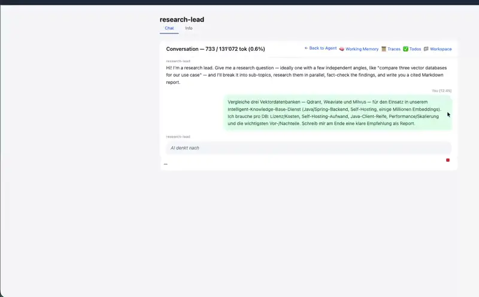

<p align="center">
  <picture>
    <source media="(prefers-color-scheme: dark)" srcset="../.github/assets/logo-dark.svg">
    
  </picture>
</p>

<h1 align="center">agents</h1>

A runtime for **meta-assistants**: an agent that can call other agents.
Each agent is *system prompt + model + tools* with its own session,
memory and message history. A main agent decomposes a task and hands
sub-tasks to specialized sub-agents — for parallelism, specialization,
and a smaller main context.

This area is a self-contained platform — it builds and runs on its own
and does not require `semantic-ui/` or `workflow/`.


## How sub-agents work

The model picks a sub-agent through a tool call
(`run_agent("web-researcher", "Research Qdrant")`). The sub-agent runs in
its **own session** — own prompt, tools and model — does its work, and
returns the result. Sub-agents can call sub-agents recursively.


## Example: the research-lead flow

A `research-lead` agent decomposes a question, spawns `web-researcher`
sub-agents in parallel, has a `verifier` check the findings, and writes
the final answer to the shared workspace.


Here it is running end to end — plan, parallel sub-agents, verify, and
the finished `report.md` in the workspace:



## Modules

### `core/` — libraries (no runnable apps)

| Module | Purpose |
|--------|---------|
| `mc-agent-runtime` | Execution engine: sessions, memory, tool dispatch, sub-agent calls |
| `mc-llm-gateway` | LLM abstraction — streaming chat, model routing |
| `mc-message-repository` | Conversation & message storage |
| `mc-credentials` | Credential storage for tools and providers |
| `mc-agent-tools*` | Built-in tool providers (web, browser, document, todo, workflow) |

### `mcp/` — Model Context Protocol servers as tools

Registered, not compiled in: an operator adds a server in the admin UI and its
tools join the catalog. Split like the rest of `agents/` — ports in `-core`,
the in-process implementation beside them — so a gateway can later run on a
server of its own without the tool side noticing.

| Module | Purpose |
|--------|---------|
| `mc-mcp-gateway-core` | Ports and types: `McpGateway`, `McpRegistryAdmin`, `McpCatalog`, `McpServerRegistration`, `McpTarget` |
| `mc-mcp-gateway-local` | The in-process gateway — registrations on disk, discovery cache, Docker catalog |
| `mc-mcp-proxy` | Talks to one server over stdio or streamable HTTP, on the official MCP Java SDK |
| `mc-agent-tools-mcp` | The `MultiToolProvider` that turns every registered server's tools into agent tools |
| `mc-mcp-gateway-admin-ui-rest` | The `/mcp-gateway` screen, embedded by the admin UI |

Concepts: `mc-sandbox/agents/doc/concepts/21-*`, `22-*`, `23-*`. Manual tests:
`doc/manual-tests/mcp/`.

### `adapter/` — alternative implementations of the core ports

| Module | Purpose |
|--------|---------|
| `postgres/mc-llm-gateway-pg` | `LlmConfigRepository` on Postgres — one JSONB document per config, via `mc-jdbc` |
| `postgres/mc-message-repository-pg` | `ConversationRepository` and `MessageRepository` on Postgres — paged by `created_at` / `seq` |
| `postgres/mc-agent-runtime-pg` | The runtime's seven ports on Postgres — definitions, sessions, LLM traces, todo lists, summaries, working memory, workspace files |
| `postgres/mc-file-store-pg` | `FileStore` on Postgres — uploads as `bytea` rows |

The default stores are file-based and need no database. A `-pg` module is a
drop-in for the matching `File*` repository: same port, same constructor
shape (a `DataSource` instead of a directory), wrapped by the same decorators.

To run an app on Postgres, set three variables (the `start.sh` scripts read
them from `mc.env`) — the tables are created on start, no migration tool:

```bash
MC_PERSISTENCE=postgres            # default: file
MC_POSTGRES_URL=jdbc:postgresql://localhost:5432/mindconnect
MC_POSTGRES_USER=mindconnect
MC_POSTGRES_PASSWORD=…
```

Embedding without Spring: `AgentRuntimeBuilder.usePostgres(dataSource, dataDir)`.

### `springstarter/` — Spring Boot starters

| Module | Purpose |
|--------|---------|
| `mc-agent-starter-file` | File persistence, the default — every repository, the LLM-config store and the file store under `mindconnect.data.base-dir` |
| `mc-agent-starter-postgres` | `mindconnect.persistence=postgres` — every repository over one pooled `DataSource`, tables created on start |

An app adds both; the property picks.

### `server/` — deployable Spring Boot services

| Module | Purpose |
|--------|---------|
| `mc-agent-api-app` | Agent server (REST + WebSocket) |
| `mc-agent-admin-ui-app` | Admin UI backend |

### `client/`

| Module | Purpose |
|--------|---------|
| `mc-agent-cli` | Command-line chat client |

## Memory & collaboration

Agents share results through a workspace and remember across sessions
via episodic memory.

| Episodic memory | Shared workspace |
|---|---|
|  |  |

## Build & run

```bash
# Build the agents sub-tree
mvn -f agents/pom.xml clean install -DskipTests

# Start the agent server
mvn -f agents/server/mc-agent-api-app/pom.xml spring-boot:run

# Start the CLI (connects to a running agent server)
mvn -f agents/client/mc-agent-cli/pom.xml spring-boot:run
```

More diagrams live in [`doc/`](doc/).
