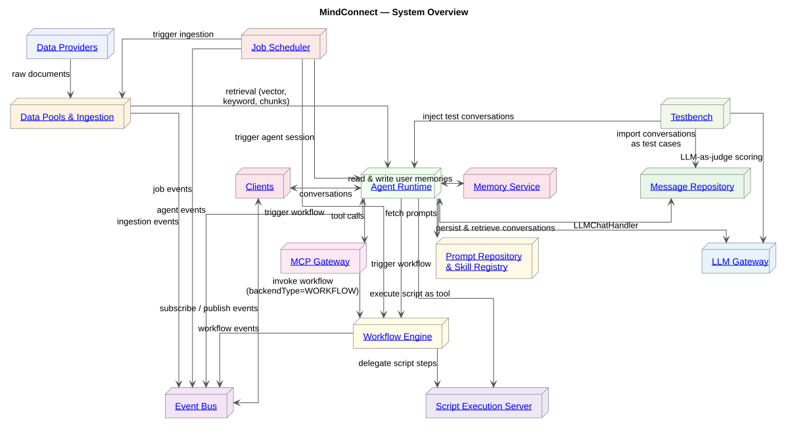
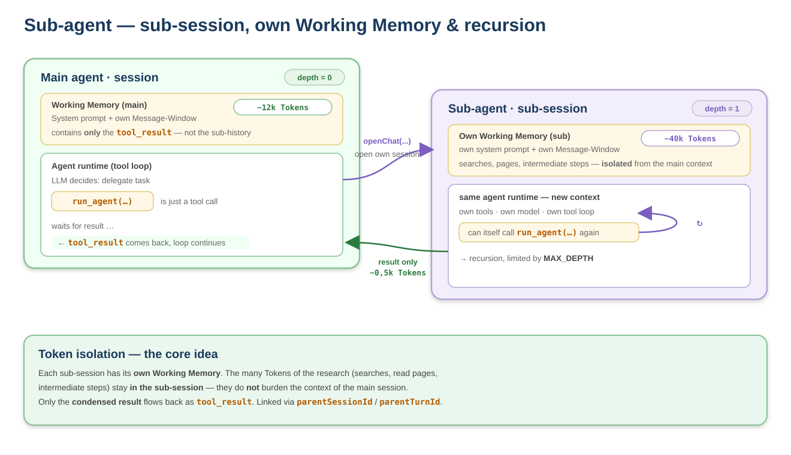
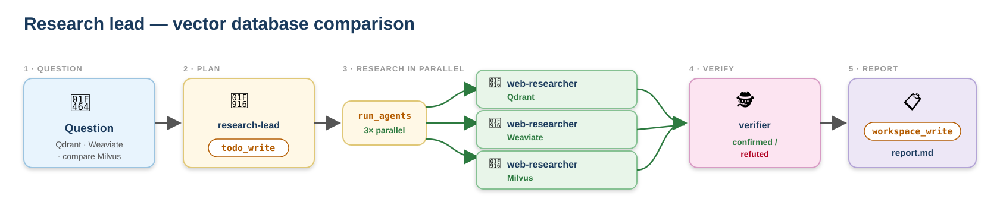
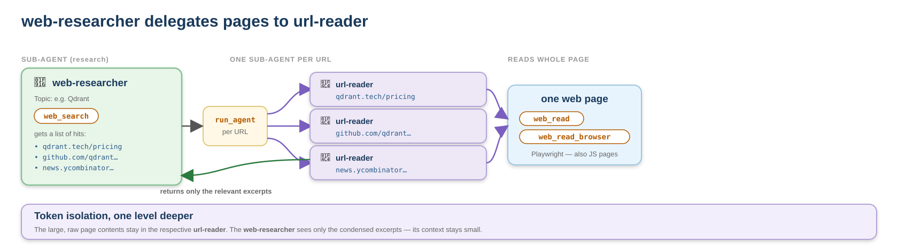
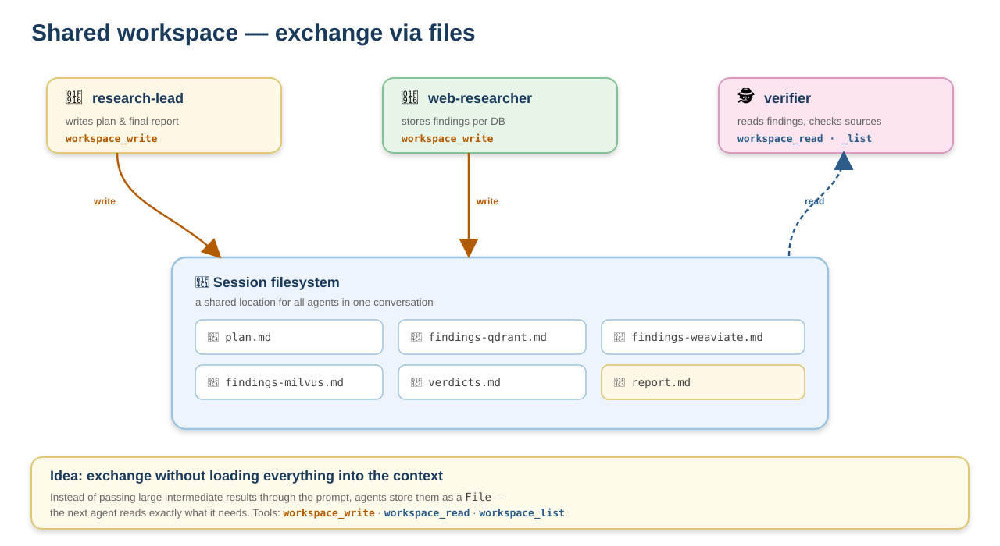
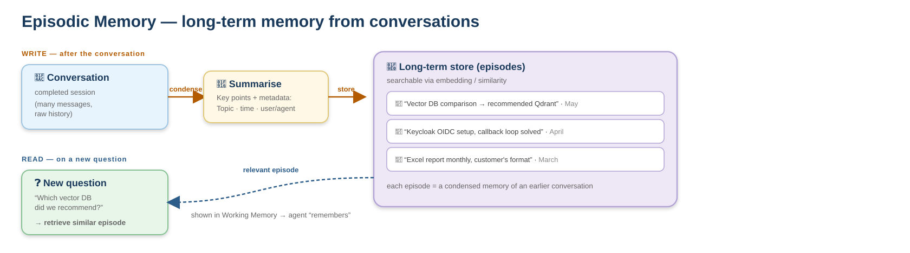

<!-- _class: lead -->

# Meta-assistants — the MindConnect Agent Runtime

### Architecture & sub-agents

David Beisert · Live demo

---
# MindConnect System Architecture

The agent server orchestrates: LLM server, MCP gateway, workflow engine, memory & message repository — clients subscribe to events.

---
# Background — how an agent (assistant) works

---
# Why sub-agents?

**One agent calls other agents — this gives you:**

- **Break down complex tasks** — decompose them into sub-tasks
- **Parallelism** — work on parts simultaneously
- **Specialization** — an HR assistant calls the IT specialist
- **The main context stays small** — the technically most important point *(more on this shortly)*
- **No switching assistants** — the user keeps talking to *one* assistant

<!--
Now that the concept is introduced, the payoff. One agent can call other agents — five
benefits, all directly transferable to the chat assistant:
- Break complex tasks into small parts.
- Parallelism — work on parts at the same time.
- Specialization — each agent good at exactly one thing; the HR assistant needn't know IT.
- The main context stays small — the technically most important point, more on the next slide.
- No need to switch assistants — the user talks to ONE, while many work in the background.
Transition: and here is how it works technically.
-->
---

# Sub-session & recursion

---
# Sub-agent call — the concept explained

- The **main agent** knows the **sub-agents**
- The model picks an agent via a tool: `run_agent("web-researcher", "Research Qdrant")`
- The sub-agent has its **own session** — own prompt, own tools, own model
- The sub-agent does its work and returns the result
- The sub-agent has its own **token window**: the sub-agent's research tokens **do not burden the main agent's context** — only the condensed result flows back
- The main agent just uses the sub-agent's result and continues

Depth limited by `MAX_DEPTH`; the sub-session is linked via `parentSessionId` / `parentTurnId`.

---

<!-- _class: lead -->

# Example: research-lead

### The orchestrator delegates in parallel & verifies

Plan → research 3× in parallel → verify → report

---

# Vector-database comparison — the flow

---

# What happens here

- **`research-lead`** decomposes the question and publishes the plan with **`todo_write`**
- **`run_agents`** starts **3 `web-researcher`s** in parallel — one DB each (Qdrant / Weaviate / Milvus)
  - each with its own session, its own model, `web_search` + reading individual pages
- Findings are checked **adversarially** by the **`verifier`** (`confirmed` / `refuted` / `uncertain`)
- **`workspace_write`** writes `report.md` — comparison table + a clear recommendation

`run_agents` (plural) = parallel fan-out; `run_agent` (singular) = one dependent follow-up step.

---

# One level deeper — url-reader

---

# Why a dedicated url-reader?

- The **`web-researcher`** searches (`web_search`) and gets a **list of hits** with URLs
- Instead of reading every page itself, it delegates **per URL to a `url-reader` sub-agent** (`run_agent`)
- The **`url-reader`** reads **one** page (`web_read` / `web_read_browser` with **Playwright**) and returns **only the relevant excerpts**
- This keeps the **large, raw page out of the web-researcher's context** — the same token isolation, one level deeper

Experiment: reading individual URLs was moved into a dedicated sub-agent.

---

# Shared workspace — exchange via files

---

# The workspace as an exchange channel

- There is a **session filesystem**: agents read & write files via `workspace_write` / `workspace_read` / `workspace_list`
- **Idea:** store large intermediate results as a **file** instead of passing them through the prompt — the next agent reads exactly what it needs
- Saves context tokens and makes artifacts (`plan.md`, `findings-*.md`, `report.md`) **traceable**

Target: one shared workspace per conversation. Today the workspace scopes are `session` (private) / `agent` / `user` — a conversation-wide shared scope would be the next step.

---

<!-- _class: lead -->

# Demo

### research-lead compares 3 vector databases

Admin UI: follow live which agent is working right now

---

<!-- _class: lead -->

# Outlook

### Extending the chat assistant with these features

Ideas for future features

---

# Outlook (1) — lean context & more reach

- **`tool_search`** — tools are loaded **on demand** instead of putting all definitions into the prompt
- **Skills** — small **instructions** per task; the agent first knows only the name + short description and loads the full instructions only when needed
  - keep the context small for recurring tasks
- **Scheduling** — recurring tasks **on a timer** (e.g. a daily report)

Common thread: keep the context lean, increase reach, make workflows plannable.

<!--
These building blocks could be added to the chat assistant — all with the same goal: keep the
context lean, increase reach.
- tool_search: the agent finds the right tool itself, instead of all definitions in the prompt.
- Skills: like a shelf full of short guides — the right one is grabbed only when the task fits.
- Scheduling: time-driven workflows instead of only on request.
-->

---

# Outlook (2) — memory & richer tools

- **Episodic memory** — long-term memory from conversations: condense after the conversation, retrieve similar episodes on a new question ("Last time we recommended Qdrant")
- **Configurable tools** — parameters & descriptions per **user/agent**; a generic tool becomes a specialized one (e.g. Confluence search fixed to one space)
- **Richer tools** — script sandbox (JS/Python, ideal for Excel), document tool (targeted reading), web fetch with **Playwright**, web search (Brave/Exa/Tavily), desktop client (Electron, local filesystem)
- **Agent UI** — the agent shows a form for structured input

<!--
- Episodic memory: beyond the session. Distinct from the short-term window and from hand-
  maintained facts in the agent workspace. (If interested: diagram ../images/episodic-memory.svg.)
- Configurable tools: the same tool, tailored per agent/user — without new code.
- Richer tools: more reach — the real web, local files, code-driven data work.
  Sandbox code replaces many single-purpose tools.
Together: the map of how the chat assistant could gradually evolve toward real sub-agents.
Transition: with that, I am at the end.
-->

---
# Outlook — episodic memory

---

# Episodic memory — how it works

- **Long-term memory from past conversations** — beyond the single session
- **After** a conversation: the history is **condensed** into an **episode** (key points + topic, time, user/agent) and stored
- **On** a new question: **similar earlier episodes** are retrieved and surfaced into the working memory — the agent "remembers"
- Distinct from:
  - the **short-term window** of the running session
  - hand-maintained **facts** in the `agent` workspace

"Last time we recommended Qdrant" — instead of starting from scratch every time.

---
<!-- _class: lead -->

# Thank you!

### Questions & discussion

David Beisert · MindConnect Agent Runtime
